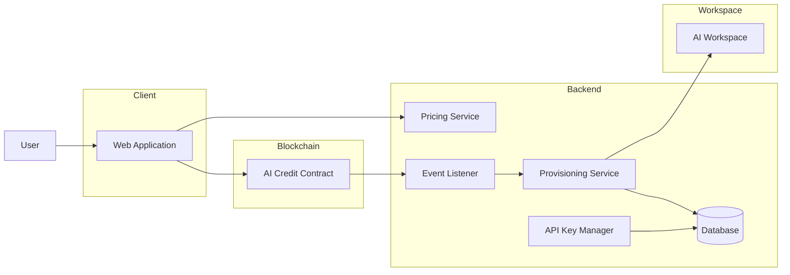
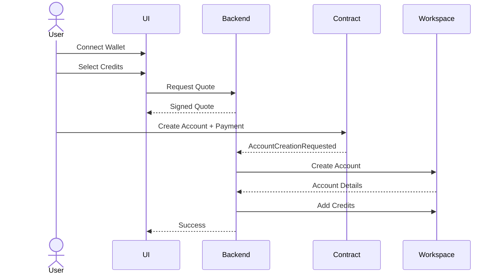
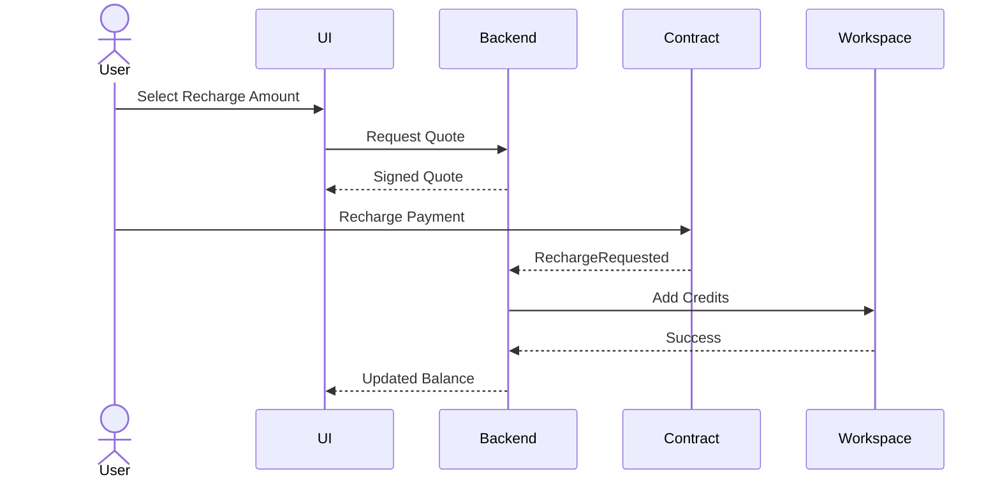
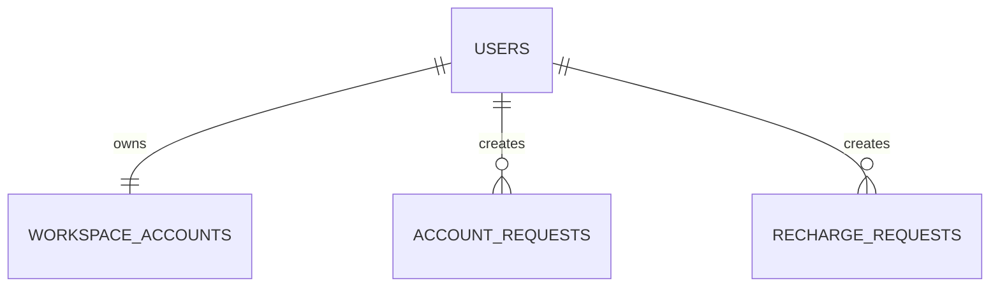

# AI Credit Marketplace

A Web3-powered platform that enables users to create AI workspace accounts and purchase AI credits using blockchain-native payments.

The system acts as a payment, provisioning, and account management layer between blockchain users and AI workspace providers.

---

# Overview

Users can:

- Connect a crypto wallet
- Create an AI workspace account
- Purchase initial AI credits
- Recharge existing AI credits
- Retrieve workspace API credentials
- Use those credentials with local AI agents

The platform leverages blockchain payments for transparency and auditability while delegating AI account and credit management to an external AI workspace provider.

---

# Problem Statement

AI providers typically require:

- Credit cards
- Centralized billing
- Traditional account creation

This platform enables:

- Crypto-native payments
- Wallet-based identity
- Automated workspace provisioning
- Decentralized payment settlement

---

# Architecture



---

# Core Components

## Client

Responsible for:

- Wallet connection
- Credit selection
- Quote retrieval
- Transaction submission
- Request status tracking
- API key retrieval

---

## Smart Contract

Responsible for:

- Receiving payments
- Verifying signed quotes
- Emitting provisioning events
- Maintaining an immutable audit trail

The contract does not:

- Create accounts
- Manage credits
- Store API keys

---

## Backend

Responsible for:

- Quote generation
- Blockchain event processing
- Workspace provisioning
- Credit allocation
- API key encryption
- Request lifecycle management

---

## AI Workspace

Responsible for:

- Account creation
- Credit balances
- API key generation
- Usage tracking

---

# Main User Flows

## Account Creation



### Flow

1. User connects wallet.
2. User selects initial credit amount.
3. UI requests pricing quote.
4. User submits blockchain transaction.
5. Contract emits account creation event.
6. Backend provisions workspace account.
7. Credits are allocated.
8. API key is securely stored.

---

## Credit Recharge



### Flow

1. User selects credit amount.
2. UI retrieves current pricing.
3. User submits payment.
4. Contract emits recharge event.
5. Backend provisions credits.
6. User receives updated balance.

---

# Pricing Model

The system supports dynamic pricing.

Pricing flow:

```text
Credits Requested
        ↓
USD Cost
        ↓
Native Token Conversion
        ↓
Signed Quote
        ↓
Blockchain Payment
```

The backend generates signed quotes that are verified by the smart contract before accepting payment.

---

# Data Ownership

| Component      | Ownership                   |
| -------------- | --------------------------- |
| Client         | Wallet session              |
| Smart Contract | Payments and events         |
| Backend        | Request lifecycle           |
| Workspace      | Accounts, credits, API keys |

---

# Security

## Wallet Authentication

Users authenticate using wallet signatures.

## Quote Validation

The contract verifies:

- Signature authenticity
- Quote expiration
- Payment amount

## API Key Security

API keys are:

- Encrypted at rest
- Never stored on-chain
- Retrieved only by authorized users

## Event Processing

All provisioning operations are triggered exclusively by confirmed blockchain events.

---

# Database Model



The database stores:

- Users
- Workspace account mappings
- Account creation requests
- Recharge requests
- Encrypted API credentials

Credit balances remain in the AI workspace.
