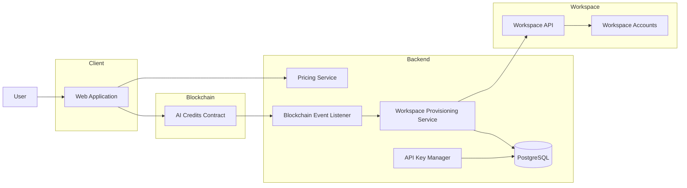
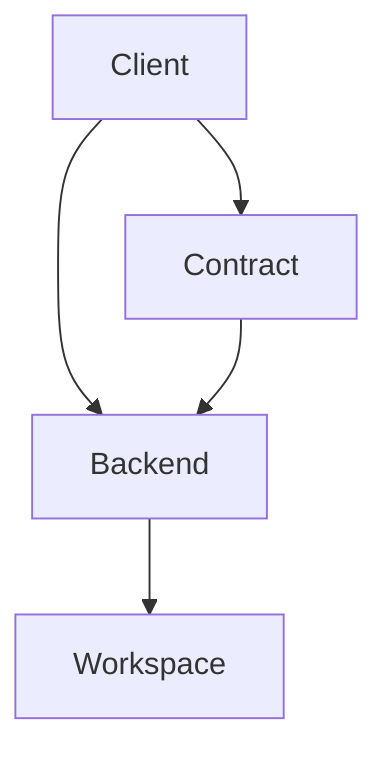

# Microservices Architecture

## Purpose

This document describes all major system components, their responsibilities, ownership boundaries, and communication patterns.

---

## Overview

The platform enables users to purchase AI workspace accounts and credits using blockchain payments.

The architecture consists of four primary domains:

1. Client Application
2. Smart Contract Layer
3. Backend Services
4. AI Workspace Provider

---

## System Architecture

---

## Component Responsibilities

### Client

Responsible for:

- Wallet connection
- Quote retrieval
- Payment initiation
- Request status tracking
- API key retrieval

The client never communicates directly with the workspace provider.

---

### Smart Contract

Responsible for:

- Receiving payment
- Verifying quote signatures
- Emitting account creation events
- Emitting recharge events
- Providing immutable audit trail

The smart contract does not create accounts or manage credits.

---

### Pricing Service

Responsible for:

- Calculating credit cost
- Converting USD to native blockchain token
- Generating signed quotes

---

### Event Listener

Responsible for:

- Listening to blockchain events
- Detecting successful requests
- Triggering provisioning workflows

---

### Provisioning Service

Responsible for:

- Creating workspace accounts
- Recharging workspace credits
- Tracking request status

---

### API Key Manager

Responsible for:

- Encrypting API keys
- Secure storage
- Controlled retrieval

---

### Workspace Provider

Responsible for:

- User accounts
- Credit balances
- API keys
- Usage tracking

---

## Service Relationships

---

## Data Ownership

| Component | Owns                        |
| --------- | --------------------------- |
| Client    | User session                |
| Contract  | Payments                    |
| Backend   | Request tracking            |
| Workspace | Accounts, Credits, API Keys |

---

## Architectural Decisions

### Why event driven?

Blockchain transactions are asynchronous.

Provisioning must happen after transaction finality.

### Why keep credits off-chain?

Credit balances change frequently.

Managing credits on-chain would be expensive and slow.

### Why use a backend?

The workspace provider cannot directly consume blockchain events.

Backend acts as the integration layer.
