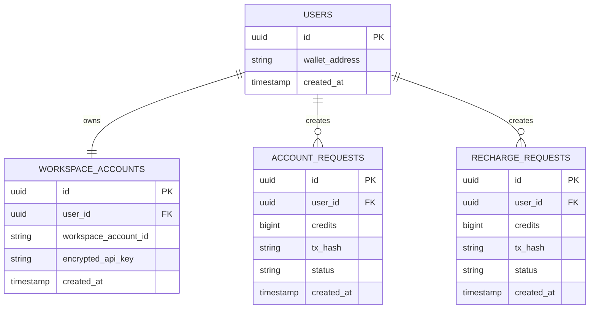
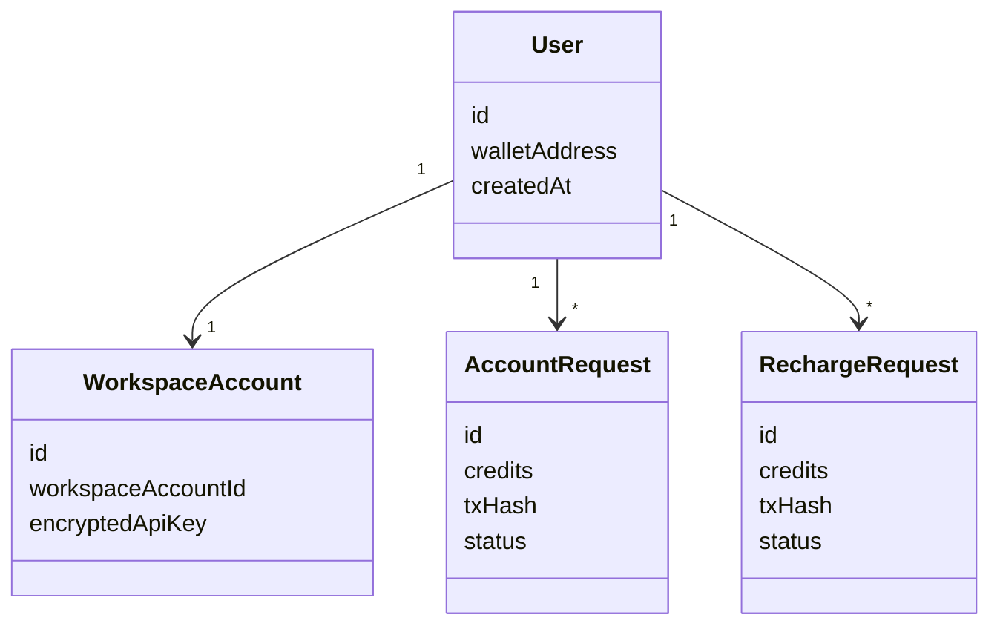
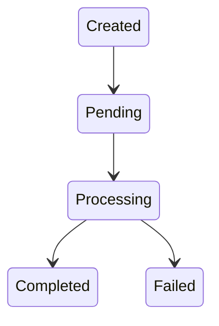

# Database Design

## Purpose

This document defines the persistence layer used by backend services.

The database does not store credits.

Credits remain the responsibility of the workspace provider.

---

## Entity Relationship Diagram

---

## Domain Model

---

## Entity Descriptions

### User

Represents a blockchain wallet owner.

One user maps to one workspace account.

---

### WorkspaceAccount

Stores:

- Workspace account id
- Encrypted API key

Actual credits remain in the workspace.

---

### AccountRequest

Tracks account creation.

Status values:

- PENDING
- PROCESSING
- COMPLETED
- FAILED

---

### RechargeRequest

Tracks recharge operations.

Status values:

- PENDING
- PROCESSING
- COMPLETED
- FAILED

---

## Request Lifecycle

