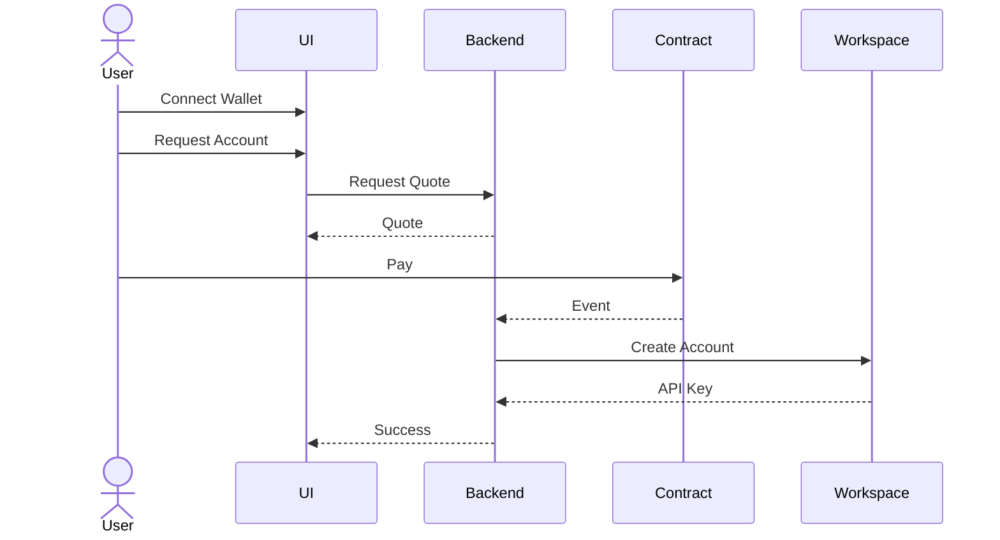
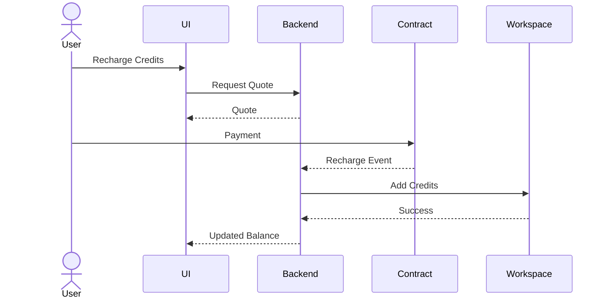

# User Experience

## Purpose

This document describes the user journey from wallet connection through AI workspace usage.

---

# Account Creation Experience

---

## Experience Goals

- Minimal onboarding
- Transparent pricing
- Real-time status tracking
- Fast provisioning

---

# Recharge Experience

