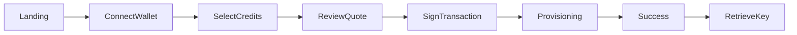
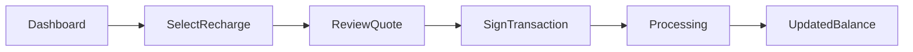

# UI Flow

## Purpose

This document defines screen-level navigation and user interactions.

---

# Account Creation Flow

---

## Screen Details

### Landing

User sees:

- Platform overview
- Connect wallet button

---

### Select Credits

User enters:

- Initial credit amount

System displays:

- Estimated usage

---

### Review Quote

System displays:

- Credits requested
- USD cost
- ETH cost
- Quote expiration

---

### Sign Transaction

Wallet approval screen.

---

### Provisioning

Shows:

- Transaction confirmation
- Account creation progress

---

### Success

Displays:

- Account created
- Credits allocated

---

### Retrieve API Key

Allows:

- Download encrypted key
- Copy key

---

# Recharge Flow

---

## Dashboard

Displays:

- Workspace account status
- Credit balance
- Recharge button

---

## Recharge Screen

User enters:

- Desired credits

System displays:

- Current conversion rate

---

## Review Quote

Displays:

- Credit amount
- USD equivalent
- Native token amount

---

## Processing

Displays:

- Transaction status
- Recharge progress

---

## Updated Balance

Displays:

- New credit balance
- Recent recharge details
