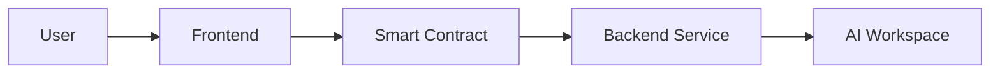
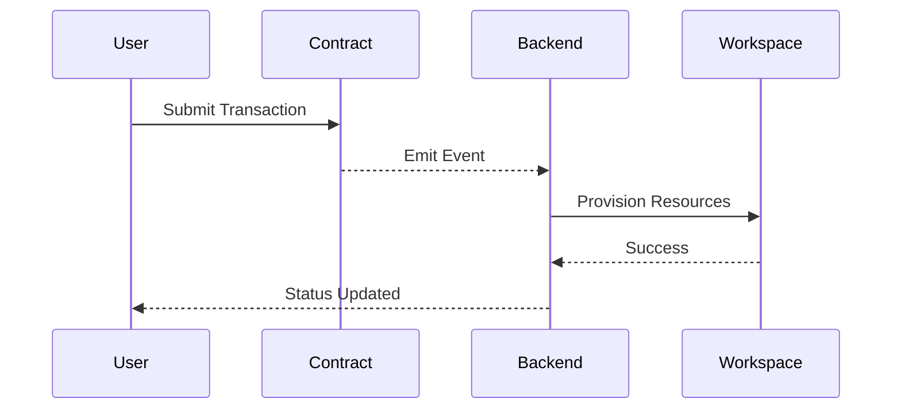

# POC Architecture

## Objective

The goal of this Proof of Concept (POC) is to demonstrate that AI workspace accounts and credits can be purchased using blockchain payments.

This hackathon version intentionally prioritizes end-to-end functionality over production readiness.

The primary success criteria are:

1. User connects wallet
2. User pays via smart contract
3. Backend receives blockchain event
4. AI workspace account is created or recharged
5. User sees successful provisioning

---

# Architecture Overview

The system consists of four major components:

1. Frontend Application
2. Smart Contract
3. Backend Service
4. AI Workspace

---

# Component Responsibilities

## Frontend

The frontend acts as the primary user interface.

Responsibilities:

- Connect wallet
- Enter desired credits
- Submit transactions
- View provisioning status

The frontend does not directly communicate with the AI workspace.

---

## Smart Contract

The smart contract serves as the payment and event layer.

Responsibilities:

- Accept payments
- Emit events

The contract does not:

- Create accounts
- Store API keys
- Manage credits

This keeps the contract simple and hackathon-friendly.

---

## Backend

The backend is the orchestration layer.

Responsibilities:

- Listen to blockchain events
- Create workspace accounts
- Recharge credits
- Store account mappings

---

## AI Workspace

Represents the external AI provider.

Responsibilities:

- Account creation
- Credit allocation
- API key generation

For the hackathon, this can be a mock service if a real provider API is unavailable.

---

# Event Flow

---

# Hackathon Assumptions

- One blockchain network
- One workspace provider
- One account per wallet
- No retries
- No advanced security

---

# Out of Scope

The following are intentionally excluded:

- Multi-chain support
- Subscription billing
- Quote signing
- API key vault
- Admin dashboard
- Retry queues

These can be added after validation of the core concept.
