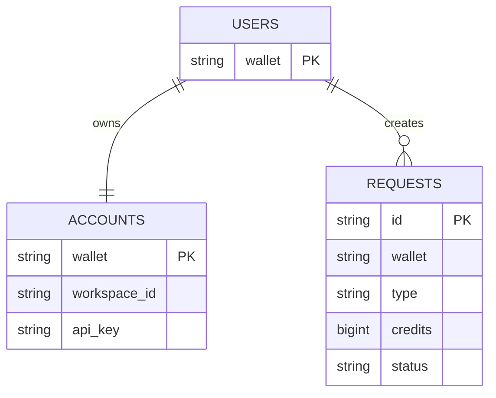
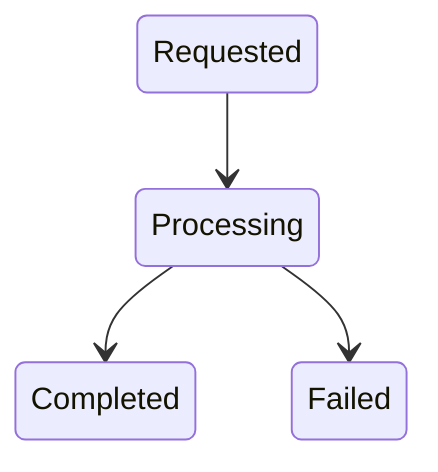

# Database Design

## Objective

The database exists solely to track user accounts and provisioning requests.

Credits themselves are not stored in our database.

Credits remain the responsibility of the AI workspace provider.

This reduces complexity and allows the hackathon team to focus on integration rather than accounting.

---

# Database Overview



---

# Entity Description

## USERS

Stores wallet owners.

Example:

```text
0x123...
```

Each wallet represents a unique user.

---

## ACCOUNTS

Maps blockchain users to workspace accounts.

Example:

```text
wallet → workspace account
```

Stores:

- Workspace account id
- API key

For the hackathon, encryption may be skipped.

---

## REQUESTS

Tracks provisioning operations.

Examples:

- Create account
- Recharge credits

---

# Request Lifecycle



---

# Why This Design

The goal is to keep the schema extremely simple.

Three tables are enough to:

- Track users
- Track accounts
- Track requests

Additional tables can be introduced later as requirements grow.
