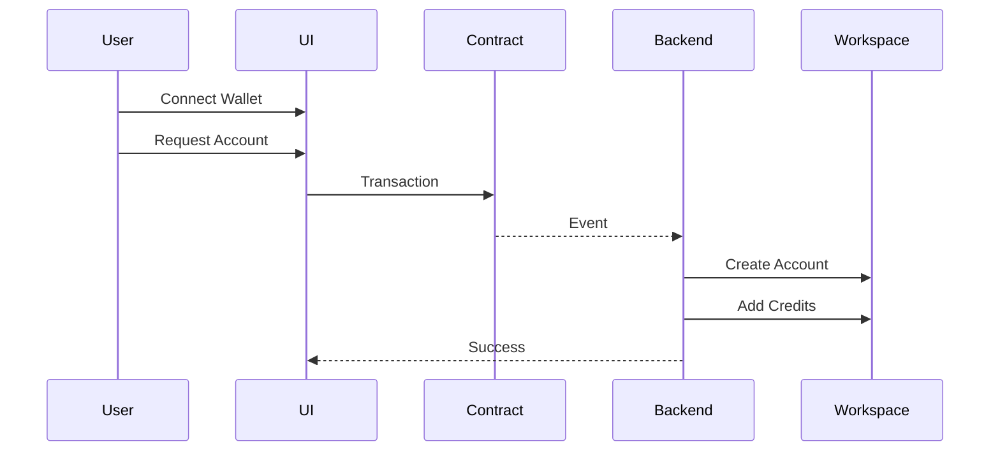
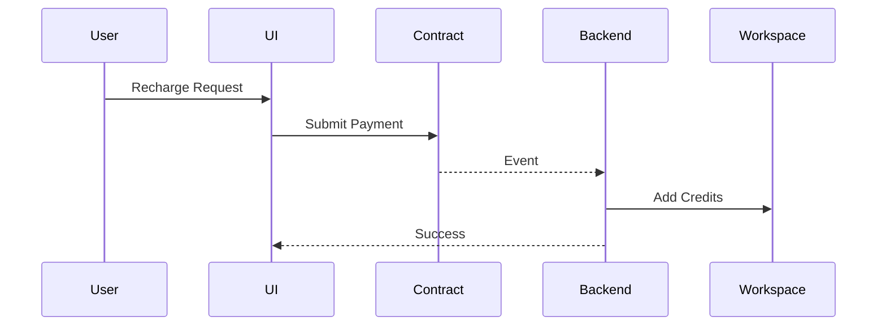

# User Experience

## Objective

This document describes how a user interacts with the platform.

The focus is minimizing friction while demonstrating blockchain-powered AI account provisioning.

---

# Account Creation Flow

A new user wants access to the AI workspace.

The process should feel similar to purchasing credits from a traditional SaaS provider.



---

# Recharge Sequence

An existing user wants additional credits.



---

# User Experience Goals

The user should:

- Never see blockchain complexity
- Understand the credit cost
- Receive immediate feedback
- Know whether provisioning succeeded

The ideal experience is:

```text
Pay → Wait → Receive Credits
```
