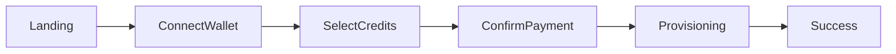
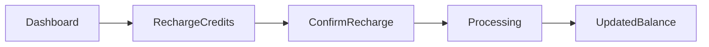

# UI Flow

## Objective

This document describes the screens required for the hackathon demo.

The goal is to keep the number of screens minimal while still demonstrating the complete workflow.

---

# Account Creation Screens

---

# Screen Details

## Landing Page

Purpose:

Introduce the platform.

Actions:

- Connect Wallet

---

## Select Credits

Purpose:

Allow users to choose initial credits.

Actions:

- Enter amount
- Continue

---

## Confirm Payment

Purpose:

Review payment details before signing.

Display:

- Credits requested
- Estimated cost

Actions:

- Approve transaction

---

## Provisioning Screen

Purpose:

Show backend activity.

Display:

- Transaction confirmed
- Creating account
- Adding credits

---

## Success Screen

Purpose:

Show successful completion.

Display:

- Account created
- Credits allocated

---

# Recharge Screens

---

# Dashboard

Displays:

- Wallet address
- Workspace account
- Current credits
- Recharge button

---

# Recharge Credits

User enters desired credits.

The UI calculates the estimated payment amount.

---

# Confirm Recharge

Displays:

- Credits requested
- Cost
- Wallet confirmation

---

# Updated Balance

Displays:

- Recharge successful
- Updated credits

---

# Demo Focus

During the hackathon demo, the audience should clearly see:

1. Wallet connection
2. Payment transaction
3. Event processing
4. Account creation
5. Credit recharge

These five steps communicate the entire value proposition of the project.
